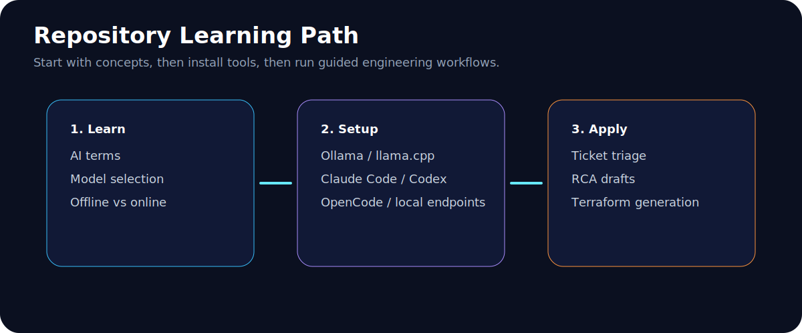

# AI for Engineers

> **A practical, engineer-friendly guide to using AI — from basics to production workflows.**


<p align="center">
  <i>Use AI as a reviewed teammate, not as an unchecked replacement.</i>
</p>

---

## 📖 Index

<!-- TOC -->

1. [About This Guide](#about-this-guide)
2. [Learning Path](#learning-path)
3. [Quick Start](#quick-start)
4. [AI Tools Overview: Free & Paid Tiers](#ai-tools-overview-free--paid-tiers)
   - [Coding Agents](#coding-agents)
   - [Local LLMs](#local-llms)
   - [Online LLMs](#online-llms)
5. [Installing IBM Bob](#installing-ibm-bob)
6. [Prompt Library](#prompt-library)
7. [Security Checklists](#security-checklists)
8. [Infrastructure & Automation](#infrastructure--automation)
9. [Official References](#official-references)
10. [Getting Help](#getting-help)

<!-- /TOC -->

---

## About This Guide

This repository is designed for **engineers who want to use AI tools responsibly** — without losing human review, security, or technical accuracy. It expands the **AI for Engineers** presentation into a self-paced, hands-on guide.

**What you will learn:**

- What LLMs, prompts, tokens, context windows, embeddings, RAG, tool calling, inference, and MCP mean.
- When to use **online LLMs** vs. **offline/local LLMs**.
- How to choose a model using name, size, format, speed, cost, license, and privacy needs.
- How to install and test local AI tools such as **Ollama** and **llama.cpp**.
- How to use coding agents like **Claude Code**, **Codex CLI**, **OpenCode**, and **IBM Bob**.
- How to create a personalized engineering assistant with reusable prompts.
- How to use AI for ticket triage, log analysis, RCA drafts, Terraform generation, documentation, and review.
- How to **keep secrets safe** and **avoid blind trust** in AI output.

> ⚠️ **Important:** Review the images in `assets/slides/` before making this repository public. Replace internal/company-branded screenshots if your organization does not allow them in public repos.

---

## Learning Path



| Stage | Guide | Goal |
|-------|-------|------|
| 1 | [AI Basics](docs/01-ai-basics.md) | Understand what AI can and cannot do |
| 2 | [Key Terms](docs/02-key-terms.md) | Learn the vocabulary engineers need |
| 3 | [Offline vs Online LLMs](docs/03-offline-vs-online-llms.md) | Choose the right operating model |
| 4 | [Model Selection](docs/04-how-to-choose-models.md) | Understand model names and trade-offs |
| 5 | [Local Setup](docs/05-local-llm-setup.md) | Run a local LLM endpoint |
| 6 | [Coding Agents](docs/06-coding-agents.md) | Use Claude Code, Codex, and OpenCode safely |
| 7 | [Personal AI Agent](docs/07-personal-ai-agent.md) | Build your reusable assistant prompt |
| 8 | [Infrastructure with AI](docs/08-infrastructure-with-ai.md) | Generate, validate, deploy, and verify safely |
| 9 | [Security Checklist](docs/09-security-and-governance.md) | Protect secrets, customer data, and code |
| 10 | [Troubleshooting](docs/10-troubleshooting.md) | Fix common setup and usage issues |

---

## Quick Start

### 1. Clone this repository

```bash
git clone https://github.com/YOUR-ORG/ai-for-engineers.git
cd ai-for-engineers
```

### 2. Read the learning path

Start here:

```text
docs/01-ai-basics.md
```

### 3. Try the first prompt

Open any AI tool and paste this:

```text
You are my engineering assistant. Help me understand this issue step by step.
First summarize the problem, then list likely causes, then ask for missing details,
then suggest safe next checks.
Do not invent facts. If you are unsure, say what needs to be verified.
```

### 4. Run a local LLM endpoint

Use either **Ollama** or **llama.cpp**. Full setup is in:

```text
docs/05-local-llm-setup.md
```

### 5. Use an agent with a repository

Try one of these tools after reading the safety guide:

```bash
claude      # Anthropic's coding agent
codex       # OpenAI's coding agent
opencode    # Open-source coding agent
bob         # IBM's enterprise AI coding partner
```

---

## AI Tools Overview: Free & Paid Tiers

### Coding Agents

| Tool | Free Tier | Paid Tier | Best For |
|------|-----------|-----------|----------|
| **[Claude Code](https://code.claude.com)** | — | $20/mo (Claude Pro) / $25/mo (Teams) | Terminal-first AI coding with strong reasoning |
| **[OpenCode](https://opencode.ai)** | ✅ **Fully free & open-source** | — | Customizable agent with plugin/MCP support |
| **[Codex CLI](https://developers.openai.com/codex/cli)** | ✅ Limited free usage | Pay-as-you-go via OpenAI API | OpenAI-powered terminal agent |
| **[IBM Bob](https://bob.ibm.com)** | ✅ 30-day trial (40 Bobcoins) | Pro $20/mo · Pro+ $60/mo · Ultra $200/mo | Enterprise SDLC, legacy modernization |
| **[GitHub Copilot](https://github.com/features/copilot)** | ✅ Free for verified students/OSS | $10/mo (Individual) · $19/mo (Business) | IDE-native code completion |
| **[Cursor](https://cursor.sh)** | ✅ Free tier (2000 completions/mo) | Pro $20/mo · Business $40/mo | AI-native IDE with agent mode |
| **[Kiro CLI](https://kiro.dev)** | ✅ Free tier available | Pro tiers for teams | Terminal AI agent with MCP integration |

### Local LLMs

| Tool | Free Tier | Paid Tier | Best For |
|------|-----------|-----------|----------|
| **[Ollama](https://ollama.com/download)** | ✅ **Free & open-source** | — | Quick local LLM setup on Mac/Linux/WSL |
| **[llama.cpp](https://github.com/ggml-org/llama.cpp)** | ✅ **Free & open-source** | — | Maximum performance, GPU acceleration |
| **[LM Studio](https://lmstudio.ai)** | ✅ **Free** | — | GUI-based local model management |
| **[LocalAI](https://localai.io)** | ✅ **Free & open-source** | — | OpenAI API-compatible local server |

### Online LLMs

| Provider | Free Tier | Paid Tier | Best For |
|----------|-----------|-----------|----------|
| **[OpenAI](https://platform.openai.com)** | ✅ Free credits on signup | Pay-per-token (GPT-4o, o-series) | General-purpose, strong reasoning |
| **[Anthropic](https://console.anthropic.com)** | ✅ Free API credits | Pay-per-token (Claude Opus, Sonnet) | Long context, safe responses |
| **[Google](https://ai.google.dev)** | ✅ **Free** Gemini API tier | Pay-per-token (Gemini 2.5 Pro) | Multimodal, large context |
| **[Groq](https://groq.com)** | ✅ **Free** fast inference | Pay-per-token | Ultra-fast inference speed |
| **[DeepSeek](https://deepseek.com)** | ✅ **Free** API tier | Pay-per-token | Strong reasoning, low cost |
| **[AWS Bedrock](https://aws.amazon.com/bedrock)** | ✅ Free tier (first month) | Pay-per-token | Enterprise AWS integration |
| **[Azure OpenAI](https://azure.microsoft.com/products/ai-services/openai-service)** | — | Pay-per-token | Enterprise Azure integration |

---

## Installing IBM Bob

**IBM Bob** is an AI-first development platform for enterprise SDLC workflows. It was announced GA on April 29, 2026, and is used by 80,000+ IBM employees internally.

### System Requirements

| Requirement | Minimum |
|-------------|---------|
| **OS** | macOS, Linux, or Windows |
| **RAM** | 4 GB (8 GB recommended) |
| **Storage** | 500 MB available |
| **Network** | Active internet connection |

### Download & Install

#### macOS

```bash
# 1. Download the .pkg installer from:
#    https://bob.ibm.com/download
#    (choose Mac ARM or Mac Intel)
# 2. Open the .pkg file and follow the installation wizard
```

#### Linux (Debian / Ubuntu)

```bash
# Download the .deb package from bob.ibm.com/download, then:
sudo dpkg -i bob-*.deb
```

#### Linux (RHEL / Fedora)

```bash
# Download the .rpm package from bob.ibm.com/download, then:
sudo rpm -ivh bob-*.rpm
```

#### Windows

```bash
# 1. Download the .exe installer from bob.ibm.com/download
# 2. Run the installer and follow the setup wizard
```

### Sign In

1. Open Bob from your applications menu or desktop shortcut.
2. Sign in with your **IBMid** ([create one here](https://www.ibm.com/account/reg/us-en/signup?formid=urx-19776)).
3. Follow the browser-based authentication flow.

### Pricing

| Plan | Price | Bobcoins Included | Best For |
|------|-------|-------------------|----------|
| **Free Trial** | ✅ Free (30 days) | 40 Bobcoins | Testing & evaluation |
| **Pro** | $20/user/mo | 40 Bobcoins/mo | Solo developers, light use |
| **Pro+** | $60/user/mo | 160 Bobcoins/mo | Teams, daily AI-assisted dev |
| **Ultra** | $200/user/mo | 500 Bobcoins/mo | Heavy modernization projects |
| **Enterprise** | Custom | Custom + pooled coins | Large orgs with compliance needs |

> 💡 1 Bobcoin ≈ $0.50. A full program modernization typically costs 2–5 Bobcoins. Simple code explanations cost 0.1–0.5 Bobcoins.

### Bobshell CLI

Bob also ships with **Bob Shell** — a terminal-based coding agent:

```bash
bob shell
```

### Next Steps After Installation

- [IBM Bob Quickstart Docs](https://bob.ibm.com/docs/ide/getting-started/quickstart)
- [IBM Bob Best Practices](https://bob.ibm.com/docs/ide/getting-started/best-practices)
- [IBM Developer Tutorials](https://developer.ibm.com/components/ibm-bob/tutorials/)

---

## Prompt Library

Pre-built prompts to use with any AI agent:

| Prompt | File |
|--------|------|
| 🎫 **Ticket Triage** | [`prompts/ticket-triage.md`](prompts/ticket-triage.md) |
| 🔍 **RCA Draft** | [`prompts/rca-draft.md`](prompts/rca-draft.md) |
| 🤖 **Support Engineer System Prompt** | [`prompts/support-engineer-system-prompt.md`](prompts/support-engineer-system-prompt.md) |
| 🏗️ **Terraform Review** | [`prompts/terraform-review.md`](prompts/terraform-review.md) |
| 📝 **Documentation Update** | [`prompts/documentation-update.md`](prompts/documentation-update.md) |

---

## Security Checklists

Always validate AI output before using it in production. Use these checklists:

- [🧹 AI Output Review](checklists/ai-output-review.md) — Validate facts, secrets, commands, and tone
- [🔒 Local LLM Security](checklists/local-llm-security.md) — Protect your local endpoint
- [🛡️ Agent Permissions](checklists/agent-permissions.md) — Safe agent configuration

### The Golden Rule

> **AI output is a draft until a human validates it.**

Before using AI output in real work, always check:

- [ ] Is the source reliable?
- [ ] Did the model invent anything?
- [ ] Are logs, errors, and commands copied correctly?
- [ ] Are secrets removed?
- [ ] Can the recommendation be tested safely?
- [ ] Is the customer-facing message clear, humble, and accurate?

---

## Infrastructure & Automation

This repo includes production-grade examples:

- **Terraform demo** — [`test-server-01/`](test-server-01/): AWS VPC with subnets, NAT, EC2, and MySQL
- **Docker Compose design** — [`Design-Prompt.md`](Design-Prompt.md): Multi-container SSH architecture
- **Setup guides** — [`set-up-local-llm.md`](set-up-local-llm.md) and [`claude-opencode-zen-setup.md`](claude-opencode-zen-setup.md)

---

## Official References

| Tool | Docs |
|------|------|
| 🤖 **Claude Code** | [code.claude.com/docs/en/setup](https://code.claude.com/docs/en/setup) |
| ⌨️ **Codex CLI** | [developers.openai.com/codex/cli](https://developers.openai.com/codex/cli) |
| 🔓 **OpenCode** | [opencode.ai/docs](https://opencode.ai/docs) |
| 🦙 **Ollama** | [ollama.com/download](https://ollama.com/download) |
| ⚡ **llama.cpp** | [GitHub](https://github.com/ggml-org/llama.cpp) |
| 🖧 **llama.cpp server** | [Server README](https://github.com/ggml-org/llama.cpp/blob/master/tools/server/README.md) |
| 🔵 **IBM Bob** | [bob.ibm.com](https://bob.ibm.com) · [Docs](https://bob.ibm.com/docs/ide) · [Pricing](https://bob.ibm.com/pricing) |
| 🪢 **Hugging Face CLI** | [hf.co/cli](https://hf.co/cli) |

---

## Getting Help

Open an issue with:

- What you tried
- Your operating system
- Tool name and version
- Error message
- Screenshot or terminal output
- What you expected to happen

> Use the template in [`ISSUE_TEMPLATE/help-needed.md`](ISSUE_TEMPLATE/help-needed.md).

---

<p align="center">
  <strong>Built for engineers. Powered by AI. Reviewed by humans.</strong>
  <br>
  <sub>MIT License · 2026</sub>
</p>
