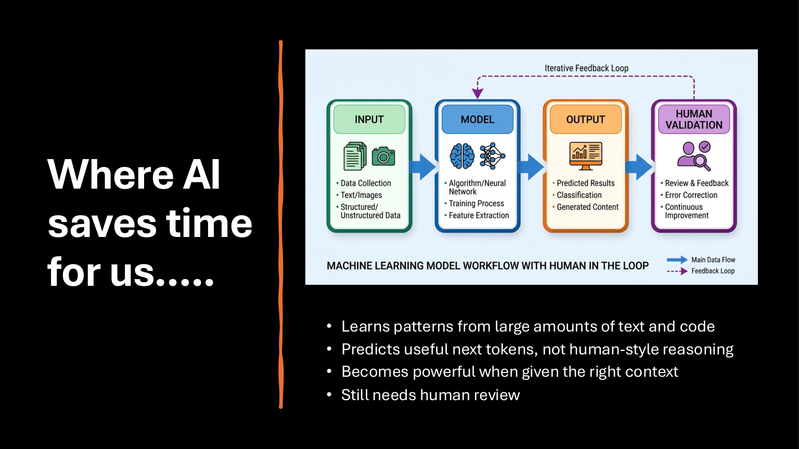
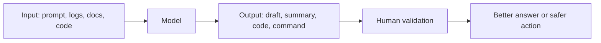

# 01 - AI Basics for Engineers



## The simple idea

AI tools are useful because they can learn patterns from large amounts of text and code. They are very good at drafting, summarizing, comparing, classifying, and generating next steps.

They are not a replacement for engineering judgment.

A useful way to think about AI:



## Where AI saves time

AI is useful when the task has patterns:

- Summarizing long customer tickets
- Finding likely causes from logs
- Drafting customer responses
- Explaining unfamiliar code
- Reviewing Terraform plans
- Creating first-pass documentation
- Converting requirements into checklists
- Generating test cases

## Where AI needs careful review

AI output needs strict review when:

- It recommends commands that modify infrastructure
- It handles customer data or secrets
- It cites documentation or version-specific behavior
- It writes production code
- It creates RCA, security, or legal-sensitive content
- It claims something is a known issue

## The golden workflow

1. Give clear context.
2. Ask for structured output.
3. Tell the model not to guess.
4. Ask it to separate facts from assumptions.
5. Verify against documentation, logs, and tests.
6. Save the prompt if it worked well.

## Example prompt

```text
You are helping me debug an engineering issue.

Context:
- Product/component:
- What changed recently:
- Exact error:
- Logs:
- Expected behavior:
- Actual behavior:

Please provide:
1. A short problem summary
2. Likely causes
3. What details are missing
4. Safe checks I can run
5. What not to conclude yet

Do not invent facts. Mark assumptions clearly.
```
