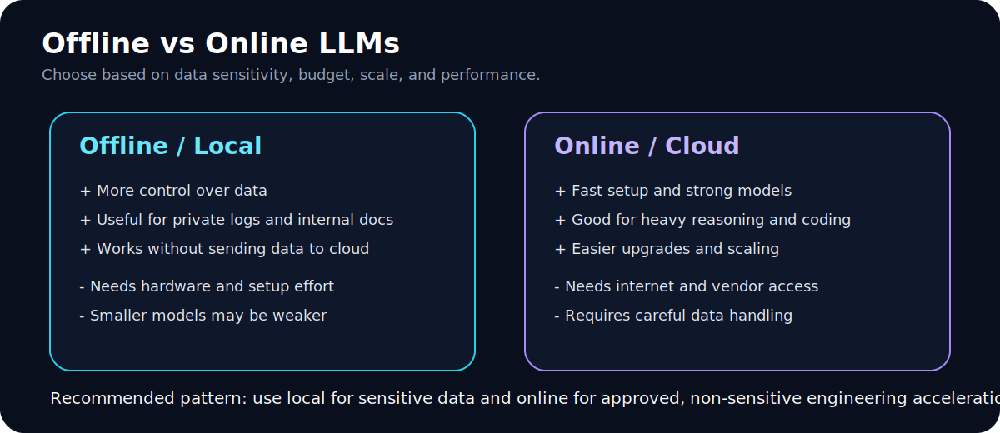

# 03 - Offline vs Online LLMs

## Offline/local LLMs

A local LLM runs on your laptop, workstation, server, or private infrastructure.

### Good for

- Sensitive logs
- Internal documentation
- Customer data that should not leave your environment
- Air-gapped or restricted environments
- Long-term experimentation

### Pros

- More control over data
- Can run inside a private network
- Good for compliance-heavy workflows
- No external API dependency for basic use

### Cons

- Requires hardware
- Setup and model management take effort
- Small models may be less accurate
- Performance depends on CPU/GPU/RAM

## Online/cloud LLMs

An online LLM runs through a provider API or hosted application.

### Good for

- General reasoning
- Code assistance
- Drafting and rewriting non-sensitive content
- Fast access to high-quality models
- Team workflows where cloud use is approved

### Pros

- Usually stronger models
- Easier to start
- No local GPU needed
- Better for complex reasoning and code tasks

### Cons

- Data leaves your machine unless enterprise controls are in place
- Requires network access
- Can have cost and rate limits
- Requires vendor trust and policy review

## Recommended engineering pattern

Use both:

| Data type | Recommended model type |
|---|---|
| Public docs | Online or local |
| Non-sensitive drafts | Online or local |
| Customer logs | Local or approved enterprise environment |
| Secrets | Do not send to any model |
| Production credentials | Never paste into AI tools |
| Source code | Follow your company policy |

## Decision checklist

Before using any AI tool, ask:

- Is this data public, internal, confidential, or secret?
- Can this data be sent to a cloud provider?
- Do I need the strongest model or the safest environment?
- Can I remove sensitive values first?
- Can I reproduce the answer without exposing real data?
