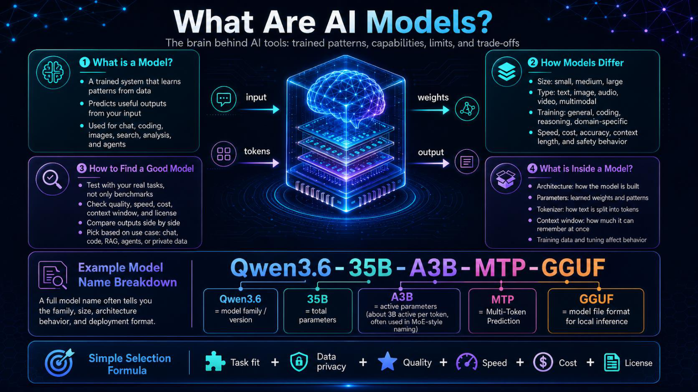

# 04 - How to Choose AI Models



## What is a model?

A model is a trained system that learns patterns from data and generates useful output from input. Different models are optimized for different tasks, such as chat, coding, reasoning, summarization, or image understanding.

## How models differ

Models differ by:

- Size
- Training data
- Reasoning ability
- Coding ability
- Speed
- Context window
- Cost
- License
- Deployment format
- Hardware requirements

## Example model name breakdown

Example:

```text
Qwen3.6-35B-A3B-MTP-GGUF
```

| Part | Meaning |
|---|---|
| `Qwen3.6` | Model family and version |
| `35B` | Approximate total parameter count |
| `A3B` | Active parameters used during inference, often seen in mixture-style models |
| `MTP` | Multi-token prediction or similar model capability label, depending on the release |
| `GGUF` | File format commonly used for local inference with llama.cpp-based tools |

## Simple selection formula

```text
Task fit + data privacy + quality + speed + cost + license = model choice
```

## Model selection examples

| Use case | Suggested model style |
|---|---|
| Fast summarization | Small or medium instruct model |
| Code generation | Code-tuned model |
| Terraform review | Strong reasoning + code model |
| Sensitive log analysis | Local model or approved internal model |
| Long document analysis | Large context model |
| Agent workflows | Model with reliable instruction following and tool-use behavior |

## Test before trusting

Create a small evaluation set:

- 5 real troubleshooting examples
- 5 documentation questions
- 5 code review examples
- 5 cases where the answer should be “not enough information”

Score the model on:

- Accuracy
- Honesty about uncertainty
- Source awareness
- Safety
- Speed
- Cost
- Formatting
