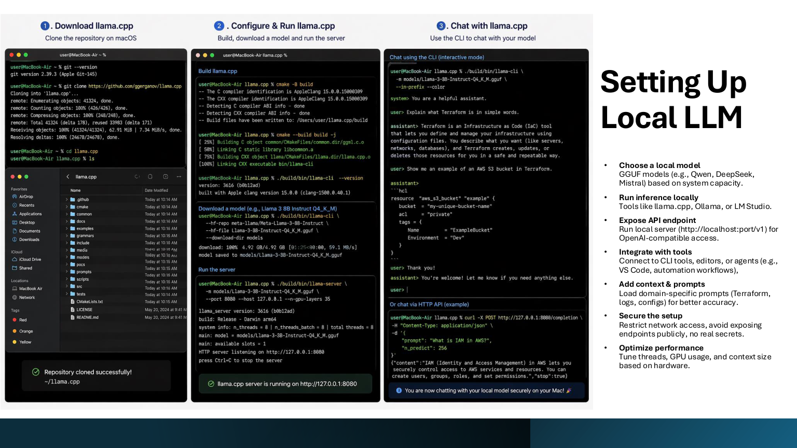

# 05 - Setting Up a Local LLM



This guide shows two simple paths:

1. **Ollama** for the easiest local model experience.
2. **llama.cpp** when you want more control over GGUF models and server settings.

---

## Option A - Ollama quick setup

Official download:

```text
https://ollama.com/download
```

### macOS / Linux

```bash
curl -fsSL https://ollama.com/install.sh | sh
```

### Windows

Use the Windows installer or PowerShell command from:

```text
https://ollama.com/download/windows
```

### Test Ollama

```bash
ollama --version
ollama pull llama3.2
ollama run llama3.2
```

### Use Ollama through an API

Ollama normally exposes a local API at:

```text
http://localhost:11434
```

Test:

```bash
curl http://localhost:11434/api/tags
```

---

## Option B - llama.cpp with GGUF models

Official repository:

```text
https://github.com/ggml-org/llama.cpp
```

### Build llama.cpp

```bash
git clone https://github.com/ggml-org/llama.cpp.git
cd llama.cpp
cmake -B build
cmake --build build --config Release
```

### Start an OpenAI-compatible server

```bash
./build/bin/llama-server -m /path/to/model.gguf --port 8080
```

Test the model list:

```bash
curl http://localhost:8080/v1/models
```

Test chat completions:

```bash
curl http://localhost:8080/v1/chat/completions \
  -H "Content-Type: application/json" \
  -d '{
    "model": "local-model",
    "messages": [
      {"role": "system", "content": "You are a helpful engineering assistant."},
      {"role": "user", "content": "Explain what a context window is in simple terms."}
    ]
  }'
```

---

## Recommended local setup checklist

- Keep the server bound to localhost unless you intentionally need LAN access.
- Do not expose local model endpoints directly to the internet.
- Never paste real secrets into local or cloud models.
- Use small test prompts first.
- Save your model name, model file, quantization, context size, and command used.
- Keep one stable model for demos and one experimental model for testing.

---

## Example configuration notes

```text
Model: Qwen / DeepSeek / Mistral / Llama family
Format: GGUF
Quantization: Q4_K_M or Q5_K_M for balanced local use
Endpoint: http://localhost:8080/v1
Use case: local summarization, support triage, log review, documentation drafts
```

---

## Common issues

| Issue | Likely cause | Fix |
|---|---|---|
| `command not found` | Binary is not in PATH | Add install folder to PATH |
| Slow response | Model too large | Use smaller quantized model |
| Out of memory | Not enough RAM/VRAM | Reduce model size or context window |
| API not reachable | Server not running or wrong port | Check logs and `curl /v1/models` |
| Bad answer quality | Wrong model or weak prompt | Try better prompt and stronger model |
