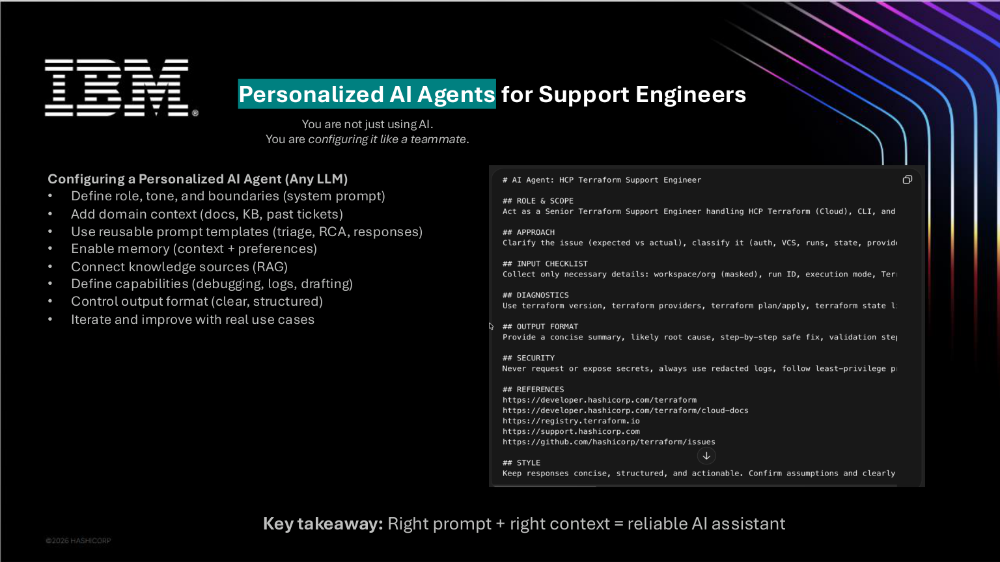

# 07 - Build a Personal AI Agent for Support Engineers



A useful AI assistant needs more than a good model. It needs a clear role, reliable context, boundaries, and reusable workflows.

## What your assistant should know

- Your role
- Your tone
- Your product area
- Your documentation sources
- Your troubleshooting style
- Your security boundaries
- Your preferred output format

## Base system prompt

Use this as a starting point:

```text
You are my senior engineering support assistant.

Role:
- Help triage technical issues.
- Summarize customer problems clearly.
- Identify likely causes from logs, docs, and configuration.
- Draft humble, accurate customer responses.
- Suggest safe next troubleshooting steps.

Rules:
- Do not invent facts.
- Separate confirmed facts from assumptions.
- Ask for missing evidence when needed.
- Prefer official documentation when giving final technical guidance.
- Never expose or repeat secrets.
- Keep responses structured and actionable.
- For customer replies, use a calm and humble tone.

Output format:
1. Summary
2. Confirmed facts
3. Likely causes
4. Missing details
5. Suggested next steps
6. Draft response if requested
```

A reusable version is available here:

```text
prompts/support-engineer-system-prompt.md
```

## Add domain context

Give the assistant relevant material:

- Official docs
- Knowledge Base articles
- Past resolved tickets
- Internal runbooks
- Product changelogs
- Example good responses
- Known limitations

## Create reusable prompt templates

Recommended templates:

- Ticket triage
- RCA draft
- Terraform plan review
- Log summarization
- Documentation update
- Customer response draft

See:

```text
prompts/
```

## Improve with feedback

After each real use case, save:

- Prompt used
- What worked
- What failed
- Correct final answer
- Any documentation link used

This turns your assistant from a generic chatbot into an engineering workflow partner.
