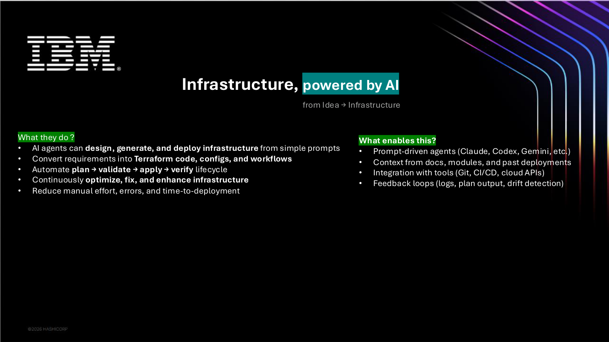
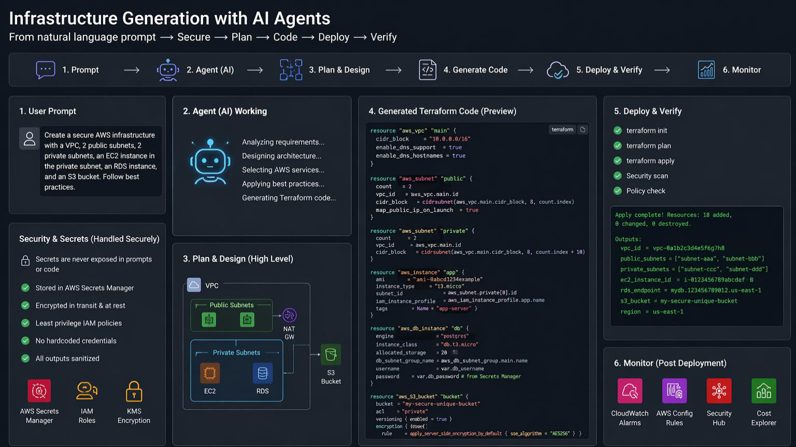
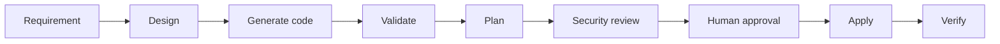

# 08 - Infrastructure with AI Agents



AI agents can help convert ideas into infrastructure plans, Terraform code, CI workflows, documentation, and validation steps.

They should not directly apply infrastructure without review.

## Safe lifecycle





## Example task for an AI agent

```text
Create a Terraform module skeleton for an AWS VPC.

Rules:
- Do not include real credentials.
- Use variables for region, CIDR, subnet count, and tags.
- Add README usage examples.
- Add validation blocks where useful.
- Add outputs.
- Add a safety checklist before apply.
- Do not run terraform apply.
```

## Required human review

Before using AI-generated infrastructure:

- Run `terraform fmt`
- Run `terraform validate`
- Review provider versions
- Review permissions and IAM scope
- Review network exposure
- Review cost impact
- Review state backend settings
- Review secrets handling
- Review destructive changes in plan

## Agent responsibilities

Good uses:

- Generate starter code
- Explain plan output
- Suggest module structure
- Draft README and examples
- Create validation checklist
- Review changes for obvious risks

Unsafe uses without approval:

- Running production applies
- Deleting resources
- Creating broad IAM permissions
- Handling raw secrets
- Changing state files directly
- Modifying CI/CD deployment credentials

## Example infrastructure review prompt

```text
Act as a cautious infrastructure reviewer.

Review this Terraform plan and tell me:
1. Resources being created, updated, or destroyed
2. Any risky network or IAM changes
3. Any cost-impacting resources
4. Any security concerns
5. Any missing variables, tags, or lifecycle controls
6. Whether this requires human approval before apply

Do not approve the plan. Only review it.
```
