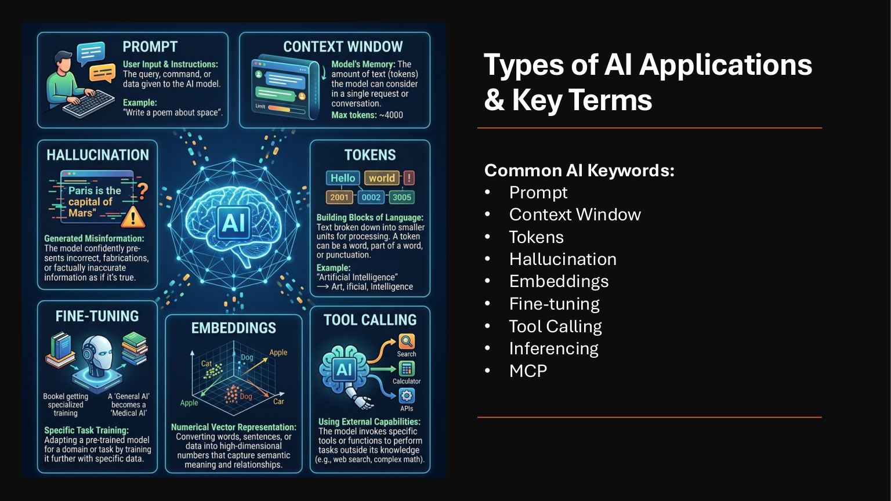
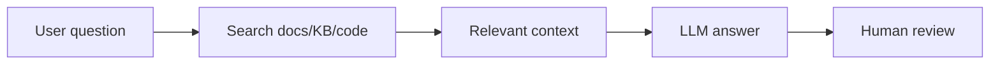

# 02 - Key AI Terms Engineers Should Know



## Prompt

The instruction you give to the AI.

Good prompts include:

- Role
- Context
- Task
- Constraints
- Output format
- Review expectations

Example:

```text
Act as a senior Terraform support engineer. Review the log below and identify likely causes. Do not provide a final answer unless the log supports it.
```

## Context window

The amount of text the model can consider at once. Large context windows are useful for long logs, large code files, and documentation, but they do not guarantee better answers.

## Tokens

Models process text as tokens. Tokens are smaller pieces of words. More tokens usually means more cost, latency, and memory usage.

## Hallucination

A confident answer that is not supported by facts. This is why engineers must verify AI output.

## Embeddings

A way to convert text into numerical vectors so related content can be found by meaning, not just keyword matching.

## RAG

Retrieval Augmented Generation. The model first retrieves relevant documents, then answers using that context.



## Fine-tuning

Training a model further on specific examples. This can help with style or domain-specific behavior, but it is not always needed. Many engineering use cases work better with strong prompts and good retrieval.

## Tool calling

The model can call tools, such as search, terminal commands, APIs, or file readers. This makes agents powerful, but also risky without permission boundaries.

## Inference

Running the model to generate output.

## MCP

Model Context Protocol. A standard way for AI tools to connect to external tools and data sources. Use it carefully because it can expose files, repositories, or services to an AI agent.
