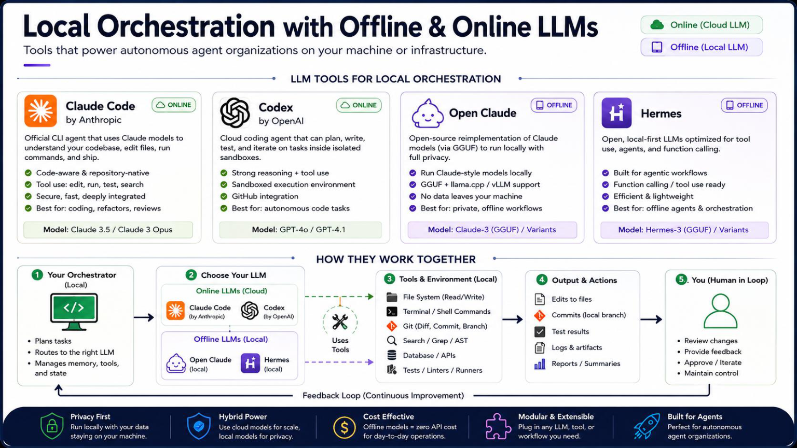
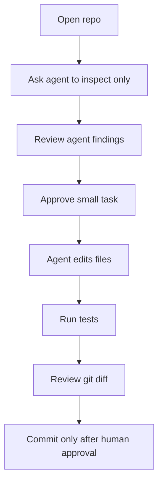

# 06 - Coding Agents for Engineers



Coding agents can read repositories, edit files, run commands, explain code, and create implementation plans. They are powerful, but they need boundaries.

## Tools covered

| Tool | Best for | Official docs |
|---|---|---|
| Claude Code | Agentic coding, repo tasks, code explanation | https://code.claude.com/docs/en/setup |
| Codex CLI | Terminal-based coding agent from OpenAI | https://developers.openai.com/codex/cli |
| OpenCode | Open-source coding agent with multiple providers | https://opencode.ai/docs/ |

---

## Claude Code setup

Claude Code requires Node.js 18 or later.

```bash
npm install -g @anthropic-ai/claude-code
claude --version
cd /path/to/your/repo
claude
```

Good first prompt:

```text
Study this repository and explain the project structure. Do not make changes yet. Give me a short map of the key files and where I should start.
```

---

## Codex CLI setup

```bash
npm i -g @openai/codex
codex
```

Good first prompt:

```text
Inspect this repository and create a safe implementation plan. Do not edit files until I approve the plan.
```

---

## OpenCode setup

```bash
curl -fsSL https://opencode.ai/install | bash
opencode
```

Or use Homebrew with the OpenCode tap:

```bash
brew install anomalyco/tap/opencode
```

Good first prompt:

```text
Review this project as a senior engineer. Identify missing documentation, risky code paths, weak error handling, and possible improvements. Do not change files yet.
```

---

## Safe agent workflow



## Agent permission rules

Give agents the minimum permission they need.

Recommended defaults:

- Allow reading project files.
- Allow editing only inside the project folder.
- Ask before running destructive commands.
- Ask before package installation.
- Block secret files such as `.env`, private keys, kubeconfigs, and credentials.
- Review every git diff before committing.

## Commands agents should not run without approval

```bash
rm -rf
sudo
chmod -R
chown -R
terraform apply
terraform destroy
kubectl delete
docker system prune
aws iam*
gcloud projects delete
az group delete
```

## Good engineering prompt pattern

```text
You are an engineering assistant working inside this repository.

Rules:
- First inspect and explain.
- Do not edit files until I approve.
- Do not read secret files.
- Do not run destructive commands.
- Keep changes small and reviewable.
- After changes, show a summary and test commands.

Task:
<describe the task>
```
